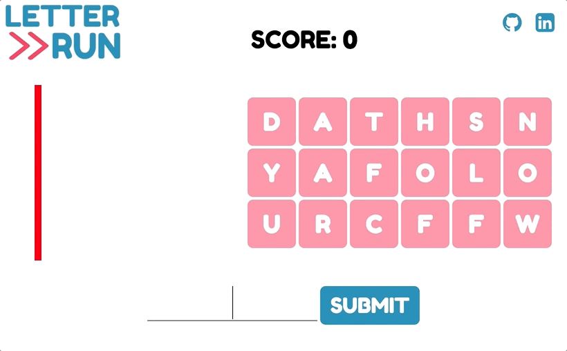

# Letter Run

[Play Letter Run!](https://virginiac32.github.io/letter-run)

## Background

Letter Run is a one-player anagram word game that is inspired by scrabble and other online word games, created by Virginia Chen.

### Gameplay



Letter Run starts with a group of letter tiles moving towards the left of the screen. As letters move left, new letters move in from the right. Type out words (with a minimum of 3 characters) that can be formed from the letters on the screen to clear those letters!

If the word is valid, those letters disappear from the screen and you gain points, with longer words being worth more points. The tiles speed up as the player's score increases. The game is over when a letter tile hits the red line on the left of the screen.

## Technologies

Letter Run was built using:
* JavaScript for the overall structure and game logic
* `jQuery` for DOM manipulation
* `webpack` to bundle the various scripts

Tiles are a series of `<li>` elements in a larger `<ul>` element. The `<ul>` element is cleared and re-rendered each step.

```javascript
render() {
  let $ul2 = document.getElementById("all-tiles");
  $ul2.remove();

  const $ul = $("<ul>");
  $ul.attr('id','all-tiles');
  for (let rowIdx = 0; rowIdx < 3; rowIdx++) {
    for (let colIdx = 0; colIdx < 10; colIdx++) {
      let $li = $("<li>");
      $li.data("pos", [rowIdx, colIdx]);
      if (this.game.board.grid[rowIdx][colIdx]) {
        $li.attr('data-letter', this.game.board.grid[rowIdx][colIdx].letter);
        $li.addClass("tile");
      }

      $ul.append($li);
    }
  }

  $(this.$el).append($ul);
}
```

The English Open Word List (EOWL) is used as the word list. A text file of the list is being hosted on Amazon Web Services, and the words are pulled into an array at the start of each game.


## Future Features
In the future, the game can be expanded to include the following features:
* A leaderboard for high scores
* Multiplayer mode to compete against other people

# Scoring

|Word Length   | Points   |
|-------|------------------|
| 3 | 5 |
| 4 | 10 |
| 5 | 15 |
| 6 | 25 |
| 7 | 35 |
| 8 | 45 |
| 9 | 60 |
| 10+ | 70 |

# Credits

The English Open Word List (EOWL) was used to validate words in this game: http://dreamsteep.com/downloads/word-games-and-wordsmith-utilities/120-the-english-open-word-list-eowl.html

The Cornell University Math Explorer's Project's English letter frequency table was used to calculate the generated letters: [frequency-table](http://www.math.cornell.edu/~mec/2003-2004/cryptography/subs/frequencies.html)

Tones from RCP Tones (dev_tones) ([CC BY 3.0 US](https://creativecommons.org/licenses/by/3.0/us/)): http://rcptones.com/dev_tones/#tabr1

Arrows graphic by <a href="http://www.flaticon.com/authors/elegant-themes">elegant_themes</a> from <a href="http://www.flaticon.com/">Flaticon</a> is licensed under <a href="http://creativecommons.org/licenses/by/3.0/" title="Creative Commons BY 3.0">CC BY 3.0</a>. Check out the new logo that I created on <a href="http://logomakr.com" title="Logo Maker">LogoMaker.com</a> https://logomakr.com/3cTBYE3cTBYE
