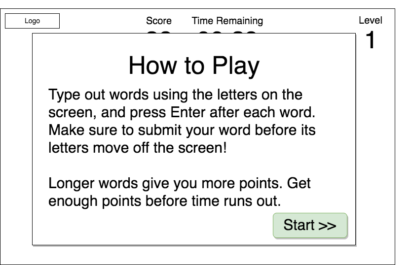
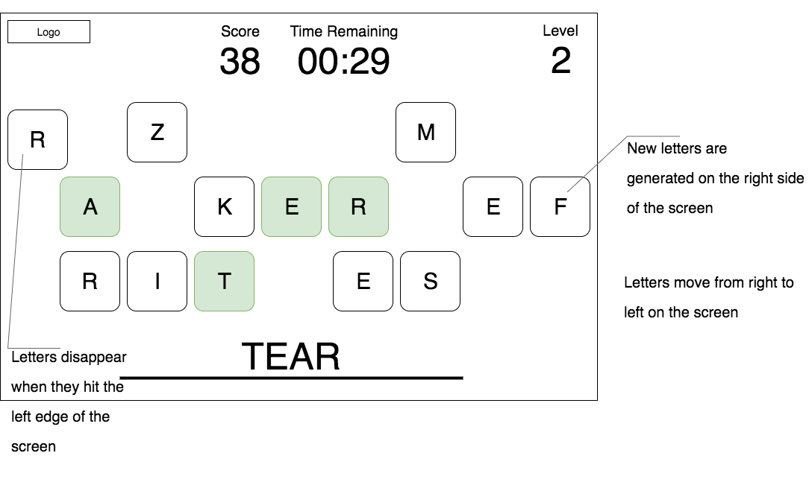

# Word Game - working title
## Background

Word Game is a one-player anagram word game that is inspired by scrabble and other online anagram games.

### Gameplay

Word Game begins with a collection of letter tiles on the screen which are moving left off of the screen, with new letters moving in from the right. The player types out a word (with a minimum of 3 characters) that can be formed from the letters on the screen. The word must be entered before any of its letters leave the screen.

If the word is valid, those letters fall out of the list and the player gains points, with longer words being worth more points. The player needs to reach X number of points per level before time is up in order to proceed to the next level.

## Functionality and MVP

The game will have the following functionality:

* Randomly generated letters that travel across the screen and disappear when they reach the left edge

* Validation of the entered word (ensure the letters exist in the string and that the word is in the dictionary)

* Used letters disappear when a word is validated

* A score tracker of the number of points the player has earned, which increases as the player submits words

* Display of the player's entered text, which updates real time

* A timer that counts down and ends the level at 0.

In addition to the above, the project will also include:

* A gameplay introduction/tutorial
* A production Readme

## Wireframes

Intro modal:

Game wireframe:

## Architecture and Technologies

The game will be implemented using the following technologies:

* Vanilla JavaScript for the overall structure and game logic
* Webpack to bundle the various scripts

The game will have the following scripts:

* Tile - this script will handle each letter tile and the random selection of the letter on each tile
* Board - this script will handle the grid on which the tiles will be displayed, plus the moving of tiles towards the left of the screen
* Word - the word/letters entered by the player. This will be a form that checks the entered word against a dictionary upon submit
* Game - this script will handle the overall game logic, rendering the game, checking when the game is over, and the levels

## Implementation Timeline

#### Day 1: Setup and configure app, Tiles, and Board
* Create the all the necessary files, including `webpack.config.js`, the script files, and `index.html`
* Create the Tile class, including random generation of letters based on frequency in words
  * Generate letters for each tile
* Create the Board class and determine how to move the tiles across the screen
  * The Board can be rendered as an HTML table, with each tile as a cell. Because the tiles move across the screen, the board should re-render with the new tile positions each X milliseconds.
  * Render the board with randomly generated tiles that move across the screen

#### Day 2: Word
* Create the Word class, be able to update the inputted letters real-time
* Figure out how to use a dictionary to validate words
  * Upon submission of the word, validate that word against a dictionary

#### Day 3: Game & remaining functionality
* Create the Game class and write the logic for the overall game, including levels
* Create the Timer and Scoreboard
  * Timer counts down to 0 and ends the level
  * The scorecard updates when the player submits words

#### Day 4: Intro modal, styling/CSS
* Create the introduction modal with instructions on how to play the game
* Pull together the look and UX of the app
  * Add CSS effects (transitions when tiles disappear, effects when the word is correct/incorrect, etc.)
  * Add sounds effects if necessary

## Bonus Features
In the future, the game can be expanded to also include the following features:
* Multiplayer mode to compete against other people

# Scoring

|Word Length   | Points   |
|-------|------------------|
| 3 | 5 |
| 4 | 10 |
| 5 | 15 |
| 6 | 25 |
| 7 | 35 |
| 8 | 45 |
| 9 | 60 |
| 10+ | 70 |

# Credits

How to import dictionary: https://johnresig.com/blog/dictionary-lookups-in-javascript/

Tones from RCP Tones (dev_tones) ([CC BY 3.0 US](https://creativecommons.org/licenses/by/3.0/us/)): http://rcptones.com/dev_tones/#tabr1

The English Open Word List (EOWL) was used to validate words in this game: http://dreamsteep.com/downloads/word-games-and-wordsmith-utilities/120-the-english-open-word-list-eowl.html

The Cornell University Math Explorer's Project's English letter frequency table was used to calculate the generated letters: [frequency-table](http://www.math.cornell.edu/~mec/2003-2004/cryptography/subs/frequencies.html)
